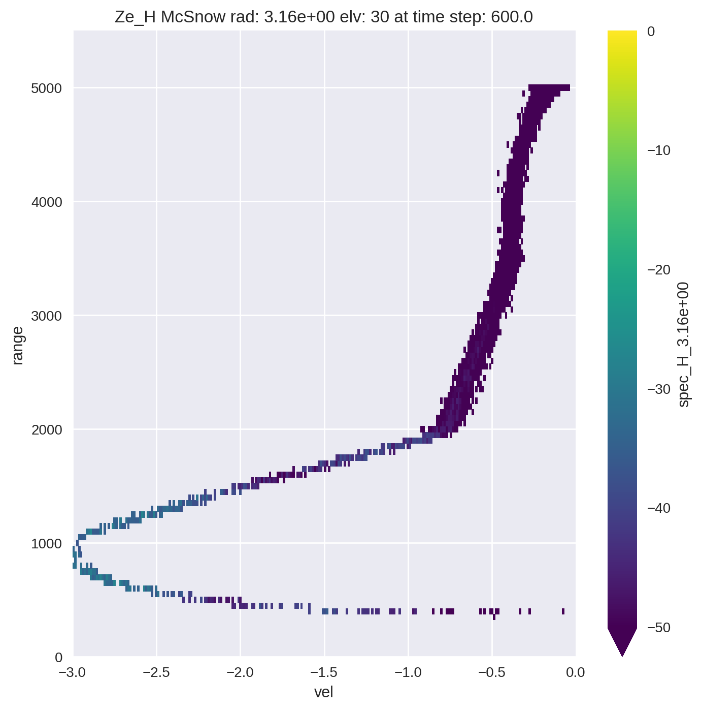

****************************
Getting Started with McRadar
****************************

Inside python
=============

First load the package

.. code-block:: python

   >>> import mcradar as mcr

Using the mcr object you can verify the default settings

.. code-block:: python

   >>> help(mcr.loadSettings)

you will get the following

.. code-block:: console

    loadSettings(dataPath=None, elv=90, nfft=512, maxVel=3, minVel=-3, 
                 ndgsVal=30, freq=array([9.5e+09, 3.5e+10, 9.5e+10]), 
                 maxHeight=5500, minHeight=0, heightRes=50)

    This function defines the settings for starting the 
    calculation.
    
    Parameters
    ----------
    dataPath: path to the output from McSnow (mandaroty)
    elv: radar elevation (default = 90) [°]
    nfft: number of fourier decomposition (default = 512) 
    maxVel: maximum fall velocity (default = 3) [m/s]
    minVel: minimum fall velocity (default = -3) [m/s]
    ndgsVal: number of division points used to integrate over the particle surface (default = 30)
    freq: radar frequency (default = 9.5e9, 35e9, 95e9) [Hz]
    maxHeight: maximum height (default = 5500) [m]
    minHeight: minimun height (default = 0) [m]
    heightRes: resolution of the height bins (default = 50) [m]
    
    Returns
    -------
    dicSettings: dictionary with all parameters 
    for starting the caculations

*dataPath* is the only required parameter. If you try to execute 
the **mcr.loadSettings()** without passing a *dataPath* parameter 

.. code-block:: python

   >>> mcr.loadSettings()

you will get a warning message

.. code-block:: console

   please load the path to the McSnow output 
   use the dataPath parameter for it 
   e.g. loadSettings(dataPath="/data/path/...")

Usage Example
=============

The following example computes the spectra and the KDP for a W-band radar with 30° elevation. The data for this example is available `here <https://github.com/jdiasn/McRadar/blob/master/tests/data_test.dat>`_, and inside of the **tests** folder.

Lets first define the initial settings
.. code-block:: python

   >>> dicSettings = mcr.loadSettings(dataPath='data_test.dat', elv=30, freq=np.array([95e9]))

Loading the McTable output

.. code-block:: python

   >>> mcTable = mcr.getMcSnowTable(dicSettings['dataPath'])

Selecting a defined time step (e.g. 600)

.. code-block:: python

   >>> selTime = 600.
   >>> times = mcTable['time']
   >>> mcTable = mcTable[times==selTime]
   >>> mcTable = mcTable.sort_values('sHeight')

Calculating the spectra and KDP

.. code-block:: python

   >>> output = mcr.fullRadar(dicSettings, mcTable)

Congratulations!! You completed all the steps. The output is an xarray dataset, and you can plot the spectra as follow

.. code-block:: python

   >>> for wl in dicSettings['wl']:

   >>>     wlStr = '{:.2e}'.format(wl)
   >>>     plt.figure(figsize=(8,8))
   >>>     mcr.lin2db(output['spec_H_{0}'.format(wlStr)]).plot(vmin=-50, vmax=0)
   >>>     plt.title('Ze_H McSnow rad: {0} elv: {1} at time step: {2}'.format(wlStr, dicSettings['elv'], selTime))
   >>>     plt.ylim(dicSettings['minHeight'], dicSettings['maxHeight'])
   >>>     plt.xlim(-3, 0)
   >>>     plt.grid(b=True)
   >>>     plt.show()

You should get the following image

 

